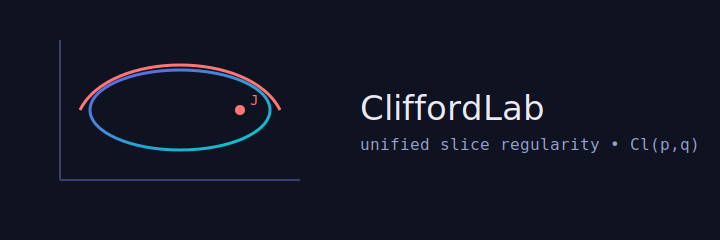

 


# CliffordLab

This repository accompanies the article:

**Unified Slice Regularity on Clifford Algebras: A Geometric and Operator-Theoretic Framework**  
by Mirco A. Mannucci  
📄 [Read the article here](https://www.academia.edu/143351560/Unified_Slice_Regularity_on_Clifford_Algebras_A_Geometric_and_Operator_Theoretic_Framework) ← 


**CliffordLab** is a lightweight laboratory for experimenting with **unified slice regularity** on real Clifford algebras \( \mathrm{Cl}(p,q) \).

It supports:
- Minimal pure-Python Clifford algebra engine (no deps)
- Unified slice utilities for \( J^2 = \pm 1 \) (elliptic & hyperbolic)
- Numerical **Cauchy-type reconstruction**
- Symbolic CR checks (via **SymPy**)
- Optional backend using **pygae/clifford**

---

## 📂 Directory Structure
```
CliffordLab/
├── README.md                # This file
├── LICENSE                  # MIT License
├── logo.svg                  # Project logo
├── pyproject.toml            # Package metadata (to be added)
├── requirements.txt          # Minimal dependencies
├── requirements-dev.txt      # Dev/test dependencies
├── src/
│   └── cliffordlab/
│       ├── __init__.py
│       ├── core.py           # Pure-Python GA & slice tools
│       ├── sym.py            # Symbolic (SymPy) helpers
│       ├── pygae.py          # pygae/clifford backend
├── examples/
│   └── CliffordLab_Tutorial.ipynb  # Jupyter tutorial
├── tests/
│   └── test_cr_conditions.py  # Unit tests for CR conditions
├── experimental/
│   └── clifford-twins/        # Nonassociative twins of Cl(3,0)
│       ├── src/clifford_twins/ # Active-volume octonion construction
│       ├── tests/              # 23 tests: associativity, alternativity, triality
│       ├── examples/           # Demo scripts
│       ├── docs/article/       # Companion paper (v8)
│       └── README.md
└── .github/
    └── workflows/
        └── ci.yml            # GitHub Actions CI pipeline
```

---

## 🚀 Quick Start

### 1. Clone the repository
```bash
git clone https://github.com/Mircus/CliffordLab.git
cd CliffordLab
```

### 2. (Optional) Create a virtual environment
```bash
python3 -m venv .venv
source .venv/bin/activate
```

### 3. Install dependencies
Minimal (pure-Python):
```bash
pip install -e .
```
With SymPy and pygae/clifford:
```bash
pip install -e .[sym,pygae]
```

---

## 🧪 Try the Examples

Run the documented notebook:
```bash
jupyter notebook examples/CliffordLab_Tutorial.ipynb
```

Or run the basic demo script:
```bash
python -m cliffordlab.core
```

---

## 📖 Features

- **Pure-Python GA core** — portable, zero dependencies.
- **Unified slice regularity** — works for \(J^2 = -1\) (elliptic) and \(J^2 = +1\) (hyperbolic).
- **Cauchy-type formula** — numerically reconstruct \(f(z_0)\) from boundary data.
- **Symbolic verification** — exact CR checks with SymPy.
- **pygae/clifford integration** — optional high-performance backend.

---

## 🛠 Development

Run tests:
```bash
pytest
```

Run lint:
```bash
ruff check src
```

---

## Experimental: Clifford Twins

The `experimental/clifford-twins/` directory contains a companion package for the article:

**Clifford Algebras and Their Nonassociative Twins: Active Volume, Split Twins, and Folded Triality**
by Mirco A. Mannucci

It implements the active-volume construction: the Clifford algebra Cl(3,0) and the octonions share the same 8D carrier H + HI, but differ in the role of the volume element (passive central vs. conjugating gate). The package provides both products on the same vector space, associator/alternativity checks, triality form, and a (Z_2)^n twisted-hypercube framework for the general classification problem.

```bash
cd experimental/clifford-twins
pip install -e ".[dev]"
pytest
```

See [`experimental/clifford-twins/README.md`](experimental/clifford-twins/README.md) for details.

---

## 🙏 Acknowledgments

CliffordLab incorporates ideas from the theory of slice regularity in quaternionic and Clifford analysis, and extensions to unified slice regularity for mixed signature algebras.
